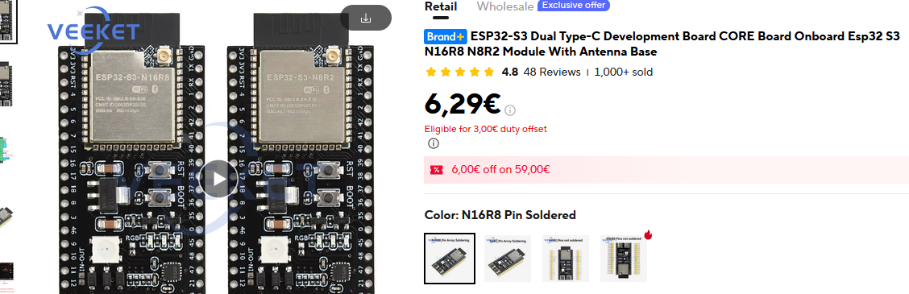
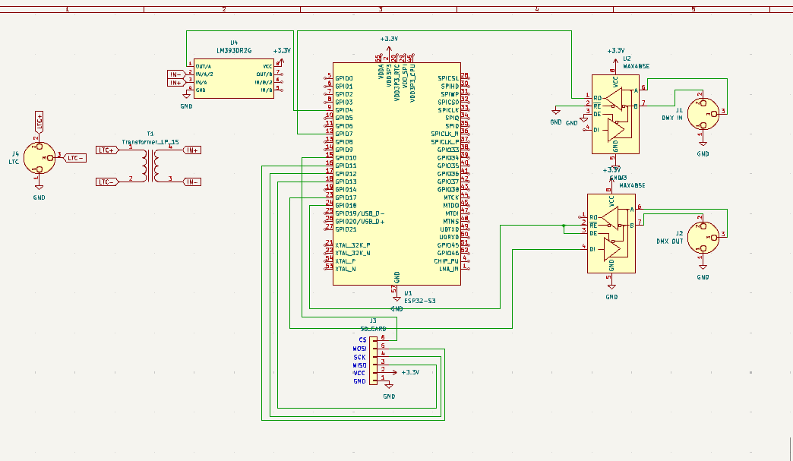
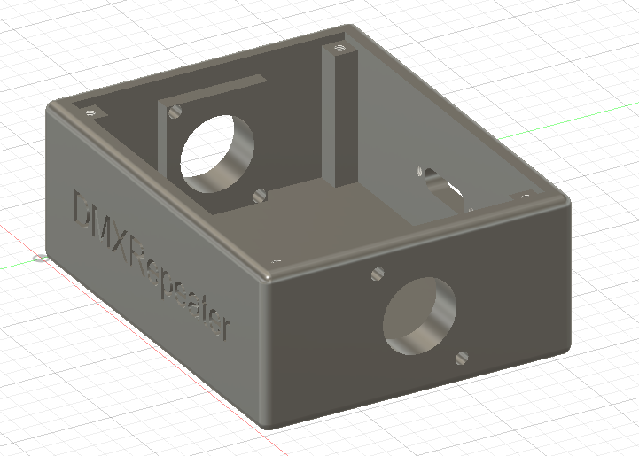
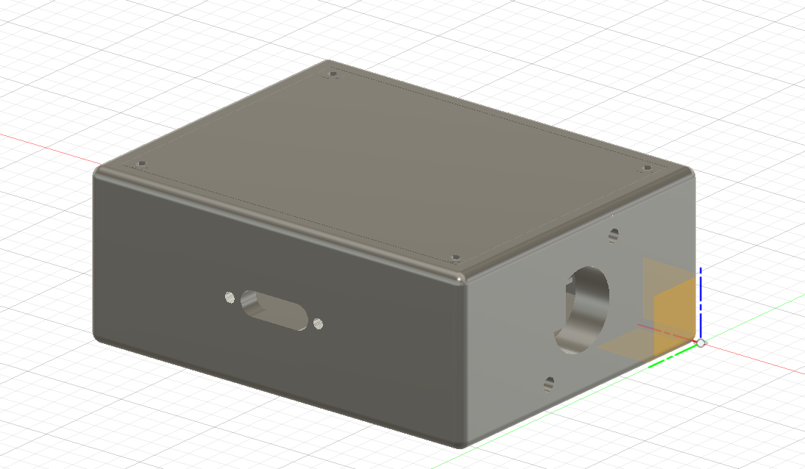
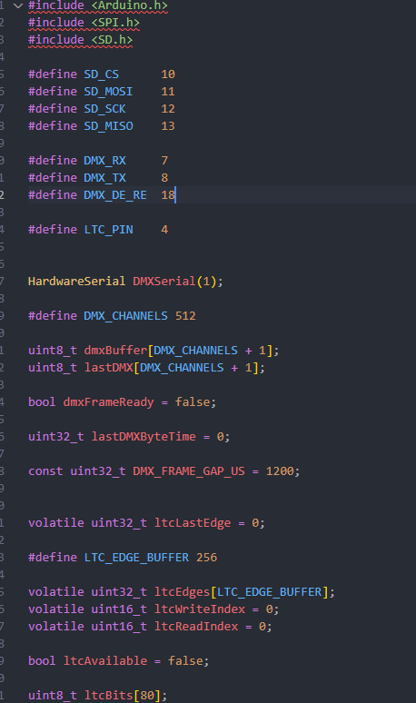

# Day 1: Define system requirements
I would like a system capable to register / repeat 1 DMX Universe.

Card register actual DMX trams and capable of repeate show for 1 universe

So for make that I made little BOM:
ESP32-S3 Devkit => 5,99€ (https://fr.aliexpress.com/item/1005009330328373.html)
MAX485 x 2 => 2,59€ (https://fr.aliexpress.com/item/1005005737922222.html)
Embase XLR x3 => 0,74€ (https://fr.aliexpress.com/item/32994485419.html)
Micro SD => 0,83€ (https://fr.aliexpress.com/item/1005009224403161.html)
Card 32GB => 4,89€ (https://fr.aliexpress.com/item/1005012294704811.html)
Panel Mount USB-c => 1,79€ (https://fr.aliexpress.com/item/1005009101248402.html)
Wire => 0,88€ (https://fr.aliexpress.com/item/1005001698292417.html)
1pcs LM393 => 1,24€ (https://fr.aliexpress.com/item/1005012824868572.html)
10pcs Red Nickel Alloy Audio Transformers 600:600 Ohm => 4.29€ (https://fr.aliexpress.com/item/1005006340217108.html)
PCB Board => 3,49€ (https://fr.aliexpress.com/item/1005007977006793.html)

= 26,73€ = $30,8

+ 3d print filament unkown$

Objective is also to get LTC timecode for start show at same time like Pro show

My box received LTC timecode and run programmed show

**Total time spent: 1.5 hours**

# Day 2: Technical reflexion
I would like make a PCB but I cannot do the welding myself for surface-mount components so it's difficult to make pcb ...
As for the cost of an entire PCB, it is far too high.
I think I'll design the PCB schematic in KiCad, but I'll try to use through-holes so I can solder the ESP by hand...
I just checked the cost of a bare PCB on JLCPCB; it's $5, but there's a minimum order of 5 boards. So, I think I'll just use a standard PCB and wires—that might be more suitable.

So the goal is to complete the circuit today.

I have made on Kicad:

My problem to desgin it is to find good footprint, I search for SD Card but I cannot find it so I just made 6 pin

**Total time spent: 2 hours**

# Day 3: Box in fusion 360
I made this box clean and I will made hole for it for block it

I also made a assembly file for my project

I have take place for PCB in but no for cable because I dont use cable :)

**Total time spent: 3 hours**

# Day 4: Software part
I made software helped by AI: [text](Software/repeaterDMX/repeaterDMX.ino)
I retry lot of time with ChatGPT to have a good version and compilable for ESP

This software is tested to transfer on a ESP-WROOM-32 at home but I cannot test module because I havent it :(

I also calculate frame and storage for show:
44FPS is the better value between sd storage and fiability with 22.7 kB/s

**Total time spent: 1 hours**

# Project Response 1
I have received this message: 
hey, can you add a little section in the readme about why you chose to make it? also you need to format your BOM.csv properly

So two problems on my project: 
-> BOM csv without $ currency (resolved)
-> README file with mention why chose this ? (resolved)

**Total time spent: 0.25 hours**
